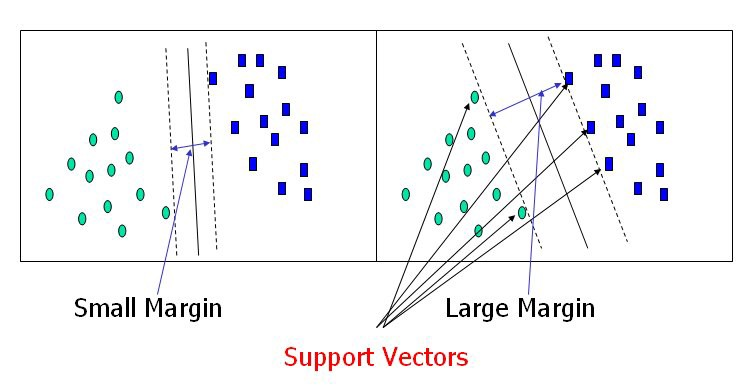

# BD04- Predictive maintenance
## Casusgroep 7
### Dimitri Batchev, Dwayne Debets, Rade Grbić, Martijn Remmen en Peter Roijen
&nbsp;

# Introductie
In dit project wordt er gekeken naar predictive maintenance. Het idee achter predictive maintenance is dat door het monitoren van apparatuur of machines met sensoren, de life (of fail) cycle gemanaged kan worden en zo uitval van machines op tijd aangepakt kan worden.

&nbsp;
# Datasets
Voor het project is er gezocht naar een bruikbare dataset waarop wij predictive maintenance kunnen uitoefenen. Voor deze dataset hebben wij een aantal eisen opgesteld:
- De dataset moet echte data bevatten (geen gesimuleerde machines)
- De dataset moet voldoende complex zijn
- De dataset moet genoeg data hebben

De eerste dataset die wij gevonden hadden, is een [Machinery Fault dataset](https://www.kaggle.com/uysalserkan/fault-induction-motor-dataset) met data over machines, en wanneer deze falen. De dataset bevat genoeg data en genoeg informatie over de dataset, maar is helaas gesimuleerde data. Uiteindelijk hebben wij niet gekozen voor deze dataset.

Vervolgens hebben wij een [Predictive Maintenance dataset](https://archive.ics.uci.edu/ml/datasets/AI4I+2020+Predictive+Maintenance+Dataset) gevonden. Deze dataset bevat ook data over machines en wanneer deze falen. Helaas is dit ook gesimuleerde data. Hier hebben wij ook niet voor gekozen.

Vervolgens hebben wij een [NASA Turbofan Engine dataset](https://4cda.com/intro-to-predictive-maintenance-on-nasa-turbofan-engine-dataset-using-machine-learning/) gevonden, met data over turbofans die NASA heeft staan. Dit is helaas ook gesimuleerde data.

Uiteindelijk hebben wij een [Hard Drive failure dataset](https://www.backblaze.com/b2/hard-drive-test-data.html) gevonden. De gebruikte dataset bevat data van SSD's en HDD's per kwartaal, en de bijbehorende [SMART waardes](https://www.backblaze.com/blog/hard-drive-smart-stats/). Deze data komt van echte hard drives af, en is dus geen gesimuleerde data. Onze voorkeur ging uiteindelijk uit naar deze dataset.

## Hard Drive failure dataset
De data in de Hard Drive failure dataset komt voor uit statistieken gebaseerd op de harde schijven die Backblaze gebruikt in haar datacenter. Backblaze publiceert deze data sinds 2013, en per kwartaal van een jaar.

De data wordt, per kwartaal, in csv-bestanden gestopt per dag. Een csv-bestand van een dag is tussen de 35 en 50 mb groot en bevat ongeveer 120000 entries. Maandelijks en jaarlijks is dit dus enorm veel data. 

Wij hebben gekozen om voor dit project de data uit 2020 te gebruiken.

### SSD's en HDD's
Stukje Peter toevoegen

### Sample set
Om de sample set te genereren, hebben wij er voor gekozen om veel SMART waardes weg te laten, en ons te focussen op de SMART waardes die de meeste correlatie hebben met de failure waarde. De SMART waardes die hierbij gebruikt worden, hebben wij bepaald op basis van een [onderzoek van Backblaze](https://www.backblaze.com/blog/what-smart-stats-indicate-hard-drive-failures/). Backblaze kiest voor deze 5 SMART waardes op basis van ervaring, en op basis van de input van producenten van harde schijven. Daarnaast hebben wij zelf nog twee SMART waardes hieraan toegevoegd, namelijk `SMART 9` (Power-On Hours, dus hoeveel uur de schijf aan heeft gestaan) en `SMART 194` (Temperature, dus de temperatuur van de schijf). Wij verwachten dat deze 7 SMART waardes het meeste te maken hebben met de failure van schijven.

#### Sample set genereren
Voor het genereren van de sample set hebben wij de data opgesplitst in 3 delen (januari tot en met juni, juli tot en met november en december), om per deel data cleaning toe te passen. Dit hebben wij gedaan omdat wij anders te maken kregen met memory errors. Deze memory errors kregen wij op een PC met 32GB RAM. 

Uiteindelijk hebben we de verschillende delen gemerged om zo tot een dataset te komen met de gewenste SMART waardes voor het jaar 2020. Dit is terug te vinden in 
notebook `1 - sample generating`.

&nbsp;
# Modellen
In dit onderdeel gaan er een aantal modellen bekeken en onderzocht worden die gebruikt zouden kunnen worden voor het kunnen predicten van maintenance van een hard drive.

Het predicten van maintenance van een hard drive zal gaan door te kijken naar de SMART waardes van een hard drive. Dit zullen tevens dan ook de features zijn die gebruikt gaan worden voor het predicten. Hiervoor zijn er een aantal prediction models die mogelijk gebruikt gaan worden:

- Decision Trees
- Random Forests
- Gradient Boosting Machines
- Support Vector Machines
- Neural Network

## Decision Trees

Decision Tree onderzoek toevoegen

## Random Forests

Random Forest onderzoek toevoegen

## Gradient Boosting Machines

Gradient Boosting onderzoek toevoegen

## Support Vector Machines

SVM onderzoek toevoegen

## Neural Network

LR onderzoek toevoegen