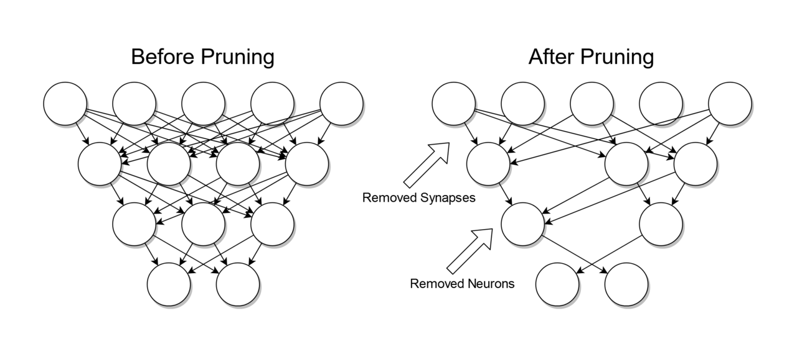

# BD04- Predictive maintenance
## Casusgroep 7
### Dimitri Batchev, Dwayne Debets, Rade Grbić, Martijn Remmen en Peter Roijen
&nbsp;

# Introductie
In dit project wordt er gekeken naar predictive maintenance. Het idee achter predictive maintenance is dat door het monitoren van apparatuur of machines met sensoren, de life (of fail) cycle gemanaged kan worden en zo uitval van machines op tijd aangepakt kan worden.

&nbsp;
# Datasets
Voor het project is er gezocht naar een bruikbare dataset waarop wij predictive maintenance kunnen uitoefenen. Voor deze dataset hebben wij een aantal eisen opgesteld:
- De dataset moet echte data bevatten (geen gesimuleerde machines)
- De dataset moet voldoende complex zijn
- De dataset moet genoeg data hebben

De eerste dataset die wij gevonden hadden, is een [Machinery Fault dataset](https://www.kaggle.com/uysalserkan/fault-induction-motor-dataset) met data over machines, en wanneer deze falen. De dataset bevat genoeg data en genoeg informatie over de dataset, maar is helaas gesimuleerde data. Uiteindelijk hebben wij niet gekozen voor deze dataset.

Vervolgens hebben wij een [Predictive Maintenance dataset](https://archive.ics.uci.edu/ml/datasets/AI4I+2020+Predictive+Maintenance+Dataset) gevonden. Deze dataset bevat ook data over machines en wanneer deze falen. Helaas is dit ook gesimuleerde data. Hier hebben wij ook niet voor gekozen.

Vervolgens hebben wij een [NASA Turbofan Engine dataset](https://4cda.com/intro-to-predictive-maintenance-on-nasa-turbofan-engine-dataset-using-machine-learning/) gevonden, met data over turbofans die NASA heeft staan. Dit is helaas ook gesimuleerde data.

Uiteindelijk hebben wij een [Hard Drive failure dataset](https://www.backblaze.com/b2/hard-drive-test-data.html) gevonden. De gebruikte dataset bevat data van SSD's en HDD's per kwartaal, en de bijbehorende [SMART waardes](https://www.backblaze.com/blog/hard-drive-smart-stats/). Deze data komt van echte hard drives af, en is dus geen gesimuleerde data. Onze voorkeur ging uiteindelijk uit naar deze dataset.

&nbsp;
## Hard Drive failure dataset
De data in de Hard Drive failure dataset komt voor uit statistieken gebaseerd op de harde schijven die Backblaze gebruikt in haar datacenter. Backblaze publiceert deze data sinds 2013, en per kwartaal van een jaar.

De data wordt, per kwartaal, in csv-bestanden gestopt per dag. Een csv-bestand van een dag is tussen de 35 en 50 mb groot en bevat ongeveer 120000 entries. Maandelijks en jaarlijks is dit dus enorm veel data. 

Wij hebben gekozen om voor dit project de data uit 2020 te gebruiken.

&nbsp;
## SSD's en HDD's
Om accuraat te voorspellen wanneer een harde schijf zal falen heeft de projectgroep de insteek om onderscheid te maken tussen HDD's en SSD's aangezien beide schijftypen intern anders werken.

De organisatie Backblaze heeft zelf al onderzoek gedaan waar achterhaald is welke [S.M.A.R.T waardes](https://www.backblaze.com/blog/are-ssds-really-more-reliable-than-hard-drives/) invloed hebben op de levensduur en failure rate van SSDs. Echter blijkt dit onderzoek nog niet volledig te zijn aangezien nog niet alle S.M.A.R.T waardes volledig bekend zijn, dit komt voornamelijk doordat de verschillende manufacturers van harde schijven gebruik maken van andere S.M.A.R.T waarden, organisatie specifieke waarden en soms afwijkende interpretaties hebben van S.M.A.R.T waarden. Desalniettemin heeft Backblaze, op basis van de publiekelijk bruikbare datasets, vastgesteld welke S.M.A.R.T waarden gebruikt <ins>*kunnen*</ins> worden om onderverdeling te maken tussen SSDs en HDDs. Ook al kunnen en wordt een mix van deze waardes gebruikt om vast te stellen welke harde schijven SSDs zijn, is het helaas niet duidelijk of dit bij het aanrijken van nieuwe data accuraat zal zijn en blijven. Dit kan helaas niet getest worden door de projectgroep aangezien geen toegang is tot verschillende SSDs. In onderstaande [*Tabel 1*](#smart_ssd) worden de relevante S.M.A.R.T waarden benoemd.

### S.M.A.R.T waardes SSD 

| #       | Beschrijving                      | #       | Beschrijving               |
| ------- | --------------------------------- | ------- | -------------------------- |
| **1**   | Read Error Rate                   | **194** | Temperature Celsius        |
| **5**   | Reallocated Sectors Count         | **195** | Hardware ECC Recovered     |
| **9**   | Power-on Hours                    | **198** | Uncorrectabel Sector Count |
| **12**  | Power Cycle Count                 | **199** | UltraDMA CRC Error Count   |
| **13**  | Soft Read Error Rate              | **201** | Soft Read Error Rate       |
| **173** | SSD Wear Leveling Count           | **202** | Data Address Mark Errors   |
| **177** | Wear Range Delta                  | **232** | Endurance Remaining        |
| **179** | Used Reserved Block Count Total   | **233** | Media Wearout Indicator    |
| **180** | Unused Reserved Block Count Total | **235** | Good Block Count           |
| **181** | Program Fail Count Total          | **241** | Total LBAs Written         |
| **182** | Erase Fail Count                  | **242** | Total LBAs Read            |
| **192** | Unsafe Shutdown Count             |

Aangezien Backblaze voor haar datasets een [artikel](https://www.backblaze.com/blog-smart-stats-2014-8.html) heeft geschreven waarin hun interpretaties staan van de betekenissen S.M.A.R.T waardes die hun hebben gemonitord worden deze betekenissen aangehouden. Dit houdt in dat op het moment een waarde wordt aangepast dat dit niet meegenomen wordt in dit project.

### Eigen ervaring
Om vast te stellen welke harde schijven, die meegenomen zijn in de gebruikte datasets van Backblaze, SSD's zijn is een inventarisatie gemaakt van alle schijf modellen. Uit deze inventarisatie blijkt dat in totaliteit een vijftal schijven SSD's zijn. Om uiteindelijk te categoriseren welke modellen SSD's zijn, is het benodigd om van de vijftal modellen waar S.M.A.R.T waardes van bekend zijn vast te stellen welke waardes onderling gebruikt worden. Hieruit blijkt dat de betreffende modellen alleen allemaal gebruik maken van de S.M.A.R.T waarde 233 (Media Wearout Indicator). Helaas is dit niet voldoende om in de toekomst accuraat vast te stellen welke schijven SSD's zijn en hier onderscheid uit te maken. Aanvullend, het blijkt dat een groot gedeelte van de eerder benoemde S.M.A.R.T waarden niet aanwezig zijn op de toegankelijke SSD modellen. Tevens wordt een groot gedeelte van deze S.M.A.R.T waardes ook gebruikt door HDD’s.

&nbsp;
## Eerste analyse sample set
Voor een eerste sample set hebben wij een aantal modellen gekozen, en hier alle data van gefiltert, uit alle data van 4 jaar, om te komen tot 1 dataset met de gekozen modellen.

Wat hier al snel bleek is dat veel harde schijven terug komen nadat ze gefailed zijn. Hier zat meestal een bepaalde tijd tussen (tussen de 3 en 9 maanden).
Hier hebben wij Backblaze een mail over gestuurd, met de vraag hoe het komt dat harde schijven terug komen nadat ze gefaald zijn. Backblaze had hier echter geen concreet antwoord op.
De meest logische verklaring die wij kunnen bedenken, is dat de harde schijven die falen, gedurende de downtime gerepareerd worden.

&nbsp;
## Eisen sample set
Om de sample set te genereren, hebben wij er voor gekozen om veel SMART waardes weg te laten, en ons te focussen op de SMART waardes die de meeste correlatie hebben met de failure waarde. De SMART waardes die hierbij gebruikt worden, hebben wij bepaald op basis van een [onderzoek van Backblaze](https://www.backblaze.com/blog/what-smart-stats-indicate-hard-drive-failures/). Backblaze kiest voor deze 5 SMART waardes op basis van ervaring, en op basis van de input van producenten van harde schijven. Daarnaast hebben wij zelf nog twee SMART waardes hieraan toegevoegd, namelijk `SMART 9` (Power-On Hours, dus hoeveel uur de schijf aan heeft gestaan) en `SMART 194` (Temperature, dus de temperatuur van de schijf). Wij verwachten dat deze 7 SMART waardes het meeste te maken hebben met de failure van schijven.

&nbsp;
## Sample set genereren
Voor het genereren van de sample set hebben wij de data opgesplitst in 3 delen (januari tot en met juni, juli tot en met november en december), om per deel data cleaning toe te passen. Dit hebben wij gedaan omdat wij anders te maken kregen met memory errors. Deze memory errors kregen wij op een PC met 32GB RAM. 

Uiteindelijk hebben we de verschillende delen gemerged om zo tot een dataset te komen met de gewenste SMART waardes voor het jaar 2020. Dit is terug te vinden in 
notebook `1 - sample generating`.

&nbsp;
# SQL

&nbsp;
# Modellen
In dit onderdeel gaan er een aantal modellen bekeken en onderzocht worden die gebruikt zouden kunnen worden voor het kunnen predicten van maintenance van een hard drive.

Het predicten van maintenance van een hard drive zal gaan door te kijken naar de SMART waardes van een hard drive. Dit zullen tevens dan ook de features zijn die gebruikt gaan worden voor het predicten. Hiervoor zijn er een aantal prediction models die mogelijk gebruikt gaan worden:

- Decision Trees
- Random Forests
- Gradient Boosting Machines
- Support Vector Machines
- Neural Network

&nbsp;
## Decision Trees

Decision tree(s) zijn een niet-parametrische supervised machine learning methode die wordt gebruikt voor classificatie en regressie. Het doel is om een model te maken dat de waarde van een doelvariabele voorspelt door eenvoudige beslissingsregels te leren die zijn afgeleid van de gegevenskenmerken.

- ***classification***: Een classification decision tree is een algoritme waarbij de doelvariabele vast of categorisch is. Het algoritme wordt vervolgens gebruikt om de "class" te identificeren waarbinnen een doelvariabele hoogstwaarschijnlijk zou vallen. Onderliggend bevatten classificatie algoritmes een [tweetal algoritmes](https://quantdare.com/decision-trees-gini-vs-entropy/) om impurities weg te werken, namelijk:

    - **gini**: Het gini algoritme meet de frequentie waarmee een element van de dataset verkeerd wordt gelabeled wanneer het willekeurig wordt gelabeld. De minimumwaarde van de Gini Index is 0, maximumwaarde is 0.5. De minimumwaarde, oftewel optimale oplossing, komt voor wanneer een knooppunt zuiver is, dit betekent dat alle elementen in het knooppunt van één unieke class is. De maximumwaarde van een knooppunt wordt behaald op het moment de waarschijnlijkheid tussen twee classes hetzelfde is.

    - **entropy**: Entropy is een algoritme die de wanorde van de features met het doelwit aangeeft. Net als bij gini wordt de optimale splitsing gekozen door de functie met minder entropie te kiezen. De minimumwaarde van entropy is 0, maximumwaarde is 1. Het krijgt zijn maximumwaarde wanneer de waarschijnlijkheid van de twee classes hetzelfde is en een knoop is zuiver wanneer de entropie zijn minimumwaarde heeft.

- ***regression***: Een regression decision tree is een algoritme waarbij de correalites tussen afhankelijke en onafhankelijke variabelen. Het helpt bij het voorspellen van de continue variabelen.

### Pruning

Pruning is een data compressie techiniek in machine learning en zoek algoritmes dat de grootte van decision trees verkleint door het verwijderen van onnodige secties van een tree (leaves/conjunctions) waar redundante informatie in verwerkt staat.

Een van de vragen die zich voordoen bij het opzetten van een decision tree algoritme is de optimale grootte van de uiteindelijke tree. Een decision tree die te groot is, loopt het risico de trainingsdata te overfitten en slecht te generaliseren naar nieuwe steekproeven. Een kleine tree kan mogelijk geen belangrijke structurele informatie over de data vastleggen. Het is echter moeilijk te zeggen wanneer een decision tree algoritme moet stoppen, omdat het onmogelijk is om te bepalen of de toevoeging van een enkele extra leaf de fout drastisch zal verminderen. Dit probleem staat bekend als het [horizon-effect](https://en.wikipedia.org/wiki/Horizon_effect). Het horizon-effect, ook wel het horizonprobleem genoemd, wordt veroorzaakt door de dieptebeperking van het zoekalgoritme en manifesteert zich wanneer een negatieve gebeurtenis onvermijdelijk maar uitstelbaar is.

Om overfitting te voorkomen in een decision tree zijn een tweetal typen van pruning ontworpen, namelijk:

- **Pre-pruning**: Een proces voor het voorkomen van een volledige inductie van de trainingsset door een stop criterium van te voren vast te stellen, bijvoorbeeld maximale tree depth. Pre-pruning methoden worden als efficiënter beschouwd omdat ze niet een hele trainingsset doen verkleinen, maar de decision tree wordt vanaf startpunt al ingekort. Een veel voorkomend gemeenschappelijk probleem tussen alle pre-pruning methoden is het ongewenst vroegtijdig beëindigen van het verkleinen door de stop criterium

- **Post-pruning**: Post-pruning, ook wel normal *pruning* genoemd, is de meest voorkomende manier voor het vereenvoudigen van een decision tree. Hier worden knooppunten en subbomen vervangen door bladeren omde complexiteit te verminderen. Pruning kan niet alleen de grootte aanzienlijk verkleinen, maar ook de nauwkeurigheid (accuracy) van de classificatie van onzichtbare objecten verbeteren. Het kan voorkmoen dat de nauwkeurigheid van de toewijzing op de trainingset verslechtert, maar de nauwkeurigheid van de classificatie eigenschappen van een decision tree neemt in het algemeen toe. Een methode om post-pruning toe te passen is middels [cost complexity pruning](https://scikit-learn.org/stable/auto_examples/tree/plot_cost_complexity_pruning.html) (ccp).

&nbsp;
## Random Forests

&nbsp;
Het random forest model is een model gebruikt voor o.a. classificatie. Het is een verzameling van verschillende decision trees. Door gebruik te maken van bagging en feature randomness op deze decision trees wordt er een “forest” gecreeërd die bestaat uit meerdere trees die niet gecorreleerd zijn met elkaar. Deze forest is in de meeste gevallen meer accuraat dan één enkele tree \cite{RandomForest}.

De reden waarom een random forest goed past bij dit project is doordat het voorspellen van failure afhangt van meerdere features, namelijk de SMART waardes. Omdat er bij random forests maar steeds met een subset van features werkt, is deze snel toe te passen op de vele SMART waardes en zorgt dit ervoor dat dit snel berekend kan worden.

&nbsp;
## Gradient Boosting Machines

&nbsp;
Boosting is een modelleringstechniek waarbij geprobeerd wordt om een sterke classifier te bouwen uit een bepaald aantal zwakke classifiers. Dit wordt gedaan door een model te bouwen op basis van een serie zwakke modellen.

- Ten eerste wordt, op basis van de trainingsdata, een model gebouwd.
- Vervolgens wordt het tweede model gebouwd, dat probeert de fouten in het eerste model te corrigeren.

Deze procedure wordt vervolgens iteratief gebruikt met meerdere zwakke modellen. De procedure stopt wanneer de volledige trainingsdataset correct is voorspeld, of het maximale aantal modellen is toegevoegd.

Gradient Boosting herdefinieert boosting als een numeriek optimalisatieprobleem, waarbij het doel is om de loss-functie van het model te minimaliseren, door ‘weak-learners’ toe te voegen middels gradient descent. Gradient descent is een iteratief algoritme, waarmee een lokaal minimum gevonden kan worden van een differentieerbare functie.

&nbsp;
## Support Vector Machines

&nbsp;
Een Support Vector Machine is een model dat aan de hand van verschillende kenmerken objecten kan classificeren. Het model maakt gebruikt van een lijn (in 2D) of een hypervlak (Hyperplane) om zo punten in een vectorruimte te scheiden in klassen. Een SVM-algoritme maakt de scheiding op basis van de marge zo groot mogelijk en gelijkmatig te maken tussen de meest nabijgelegen kenmerken van een klasse. De naam komt van de meest nabijgelegen kenmerken die ook wel support vectors worden genoemd.

Dit model is geschikt voor dit project, omdat deze goed kan omgaan met fouten en/of ruis en computers gemakkelijk een SVM-model kunnen berekenen met wel duizenden dimensies.

&nbsp;
## Logistic Regression

&nbsp;
LR onderzoek toevoegen